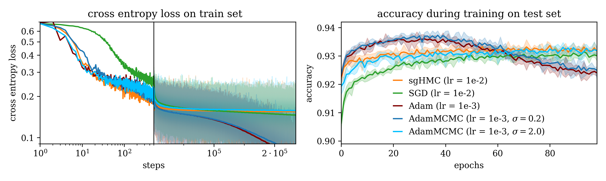
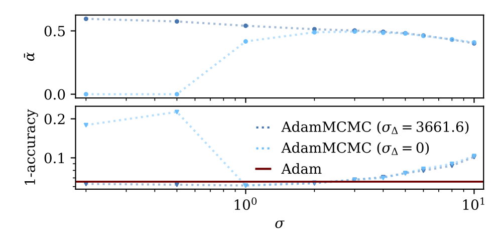
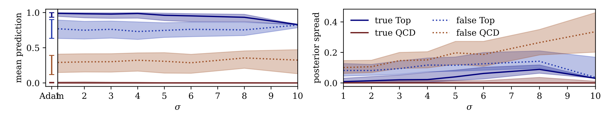

# AdamMCMC



This is the implementation of [AdamMCMC](https://arxiv.org/abs/2312.14027). It is a (stochastic) Metropolis-Hastings algorithm, with proposals $`\tilde{\vartheta}_{t+1}`$ sampled from a prolate distribution 

```math
    \tilde{\vartheta}_{t+1} \sim q_1(\vartheta \mid \vartheta_t, m_{t+1}, v_{t+1}) = \mathcal{N}\left(\vartheta; \, \vartheta_t-u_t(m_{t+1}, v_{t+1}), \Sigma_t(m_{t+1}, v_{t+1}) \right)
```

centered in Adam-update steps $`\vartheta_t-u_t(m_{t+1})`$.
The elliptical covariance of the proposal distribution

```math
    \Sigma_t=\sigma^2 \mathbb{1}_P+\sigma^2_\nabla u_t(m_{t+1}) \, u_{t}(m_{t+1})^\top
```

allows efficient sampling at low $\sigma$, where the algorithm behaves similar to the [Adam](https://arxiv.org/abs/1412.6980)-optimizer.

<div style="text-align: center;">
  
</div>

Increasing the width of the proposal distribution $\sigma$ allows adapting the uncertainty prediction of the ensemble of weight samples.



## Structure

The implementation of ParticleNet is created from the [ParT](https://github.com/jet-universe/particle_transformer) implementation  using the `weaver` [package](https://github.com/hqucms/weaver-core). 
  * <code>src/AdamMCMC.py</code> defines our AdamMCMC implementation which can by used in exchange for your usual PyTorch Optimizer
  * <code>src/MCMC_weaver_util.py</code> wraps the weaver training code for the use with MCMC methods
  * <code>train_METHOD.py</code> can be used for Network training or sampling
  * <code>eval.py</code> calculate the Network output for multiple weigth samples
  * <code>test.ipynb</code>  and <code>src/compare_adammccm_sgHMC.ipynb</code> are used for plotting

## Basic Usage

An full instructive example of converting a PyTorch training to AdamMCMC sampling is provided seperately at https://github.com/sbieringer/how_to_bayesianise_your_NN. 

### Initialization

### Training/sampling loop

### <code>train_METHOD.py</code> arguments

## Citation

For more Details see our Publication ["AdamMCMC: Combining Metropolis Adjusted Langevin with Momentum-based Optimization"](https://arxiv.org/abs/2312.14027)

```bibtex
@unpublished{Bieringer_2023_adammcmc,
    author = "Bieringer, Sebastian and Kasieczka, Gregor and Steffen, Maximilian F. and Trabs, Mathias",
    title = "{AdamMCMC: Combining Metropolis Adjusted Langevin with Momentum-based Optimization}",
    eprint = "2312.14027",
    archivePrefix = "arXiv",
    primaryClass = "stat.ML",
    month = "12",
    year = "2023",
}.
```
